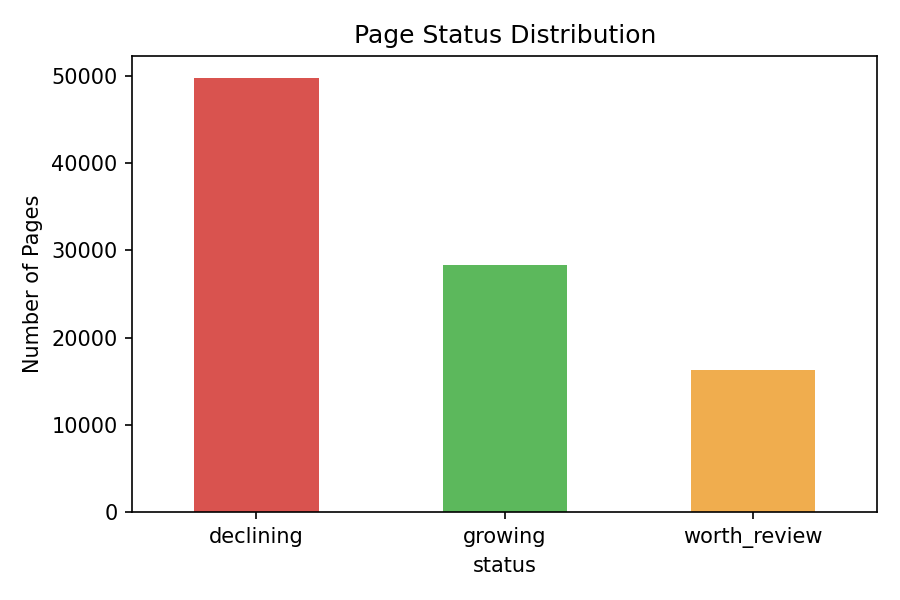
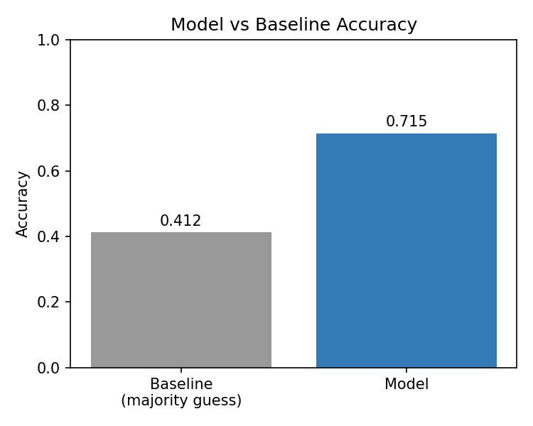
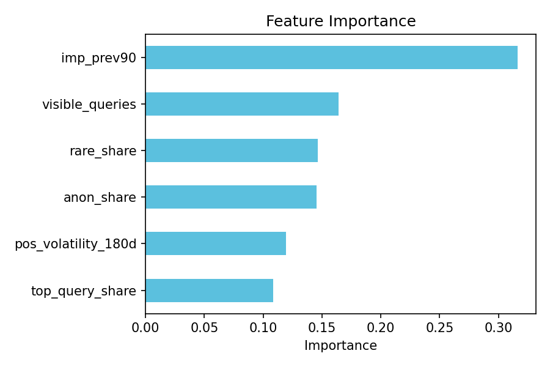

# Capstone Report — Refresh / Content Opportunity Scoring

- **Author:** Laiba
- **Lane:** Refresh / Content Opportunity Scoring
- **Repo:** https://github.com/LaibaTaseen/flyrank-ml-internship
- **Date:** 26 July 2026

---

## 0. Abstract

This project asks which website pages need editorial attention based on recent performance trends. Using 90 days of real search data across ~94,000 pages from the FlyRank warehouse, features like impression volume, ranking volatility, and query diversity were used to predict whether a page is growing, declining, or worth reviewing. A Random Forest model was validated on clients unseen during training to test real generalization, reaching 71.5% accuracy against a 41.2% baseline. The output is a ranked table of pages with a suggested action and reason for each, prioritized by traffic impact. This tool is meant to help content editors decide which pages to review first, rather than checking every page manually.

---

## 1. Problem framing

Content editors often have hundreds or even thousands of website pages to manage, so checking every page one by one takes a lot of time. This project helps them quickly find the pages that need the most attention, so they can focus on the important ones first.

**Unit of analysis:** a single content page (`content_hash_id`).
**Output:** a predicted status (Growing / Declining / Worth Review), a confidence score, a suggested action, and a reason.
**Action a human takes:** an editor reviews the top-ranked pages and decides whether to refresh, monitor, or investigate further.
**Cost of a wrong call:** wasted editorial time on stable pages that didn't need attention, or a real decliner going unnoticed until traffic loss is severe.

---

## 2. Data safety

**Data used:** FlyRank Internship Warehouse (Hugging Face) — tables `fact_content_daily_performance`, `fact_content_query_90d`, and `dim_clients`.

**Time period:** last 180 days, divided into a previous 90-day window and a current 90-day window.

**Data excluded:** `client_hash_id` and `content_hash_id` were used only to join tables and group results — never used as model features. No client names, private search queries, or raw exports appear anywhere in the notebook or this report.

**Filter:** only pages with at least 300 impressions in the previous 90 days were included, to remove very low-traffic pages where small absolute changes create misleading percentage swings.

**Leakage check:** all features (impressions, position volatility, query signals) are built only from the prior 90/180-day window; the label is defined by comparing that prior window to the current one — so no feature "sees" its own answer in advance.

---

## 3. Baseline

As a simple, transparent comparison, the baseline always predicts the most common page status (the majority class).

- Majority class: **declining**
- Baseline accuracy (always guess majority, full dataset): **0.527**
- Baseline accuracy on the held-out test split: **0.412**

This is a fair comparison because it uses the same data and the same accuracy metric as the real model — any real model needs to clearly beat this to prove it learned something useful.

---

## 4. Model / analysis

**Method:** a Random Forest classifier, chosen because it handles a mix of numeric features well and gives interpretable feature importances, both useful for explaining recommendations to non-technical editors.

**Feature list used:**
- `imp_prev90` — impressions in the prior 90-day window
- `pos_volatility_180d` — standard deviation of ranking position over 180 days
- `visible_queries` — number of distinct search queries bringing traffic
- `rare_share` — share of traffic from rare/long-tail searches
- `anon_share` — share of traffic from anonymized searches
- `top_query_share` — how concentrated traffic is on a single top query

**Left out on purpose:** `client_hash_id` and `content_hash_id` (IDs used only for grouping/joins, never as predictive features, to avoid the model memorizing specific pages or clients instead of learning general patterns).

**Target definition (one sentence):** a page is labeled "growing" if impressions rose 20%+ from the prior 90-day period to the current 90-day period, "declining" if they fell 20%+, and "worth review" otherwise.

---

## 5. Evaluation

**Split used:** grouped by `client_hash_id` (GroupShuffleSplit, 25% held out), not a random row-level split — this ensures the model is tested on clients it never saw during training, which is a fairer, more realistic test of whether it generalizes to new websites rather than just memorizing patterns from clients it already knows.

**Metrics — model vs. baseline, same split:**
- Baseline accuracy on this test split: **0.412**
- Model accuracy: **0.715**

**Per-class results:**
| Status | Precision | Recall | F1 |
|---|---|---|---|
| Declining | 0.761 | 0.865 | 0.810 |
| Growing | 0.727 | 0.848 | 0.783 |
| Worth Review | 0.496 | 0.256 | 0.338 |

**Error analysis:** the model is strong on pages that are clearly growing or declining, but noticeably weaker on the "worth review" middle category — it only catches about 26% of true worth-review pages, and is correct only about half the time when it does flag one. This is expected: "worth review" is the fuzziest, least distinct class, and it also has the fewest examples in the dataset (16,310 vs. ~50,000 declining and ~28,000 growing).

---

## 6. Interpretation

**Feature importances (most to least influential):**
1. `imp_prev90` (0.325) — a page's earlier traffic volume mattered most
2. `visible_queries` (0.176) — query diversity
3. `rare_share` (0.150) — reliance on rare/long-tail searches
4. `anon_share` (0.138) — anonymized traffic share
5. `pos_volatility_180d` (0.111) — the new volatility feature added for this project; it contributed moderately, not as the top signal but clearly not unused either
6. `top_query_share` (0.100) — least influential

**In plain words:** the size of a page's earlier traffic mattered more than how much its ranking bounced around or how concentrated its traffic was on one search term. The model's biggest error area — the "worth review" middle group — did not have one dominant explanatory factor for most high-traffic pages, suggesting these cases are genuinely mixed/ambiguous rather than driven by a single clear cause. A well-understood weak spot like this is a valid, honest finding, not a failure.

---

## 7. Recommendation

The model sorts pages by impression volume so editors can focus on the pages that matter most first. For each page, it provides: a predicted status (Growing, Declining, or Worth Review), a confidence score, a suggested action (Refresh Soon, Manual Review, or Monitor/Protect), and — when a clear factor stands out — a specific reason.

Many high-traffic pages did not have one clear reason for their performance, suggesting several factors may be affecting them together. Pages that did get a specific reason (e.g., relying too much on one search term, or getting most traffic from rare searches) are easier for an editor to act on directly.

**How an editor would use this tomorrow:** start with high-traffic pages marked "Refresh Soon," since updating these is likely to have the biggest impact. Then work down through the remaining ranked pages.

**Confidence and limits:** predictions for clearly growing or declining pages are reliable; predictions for "worth review" pages should be treated as a starting point for manual investigation, not a final answer.

---

## 8. Reproducibility

To rerun this project: clone the repository and open `work/notebooks/capstone.ipynb`. The notebook requires `duckdb`, `huggingface_hub`, `pandas`, `scikit-learn`, and `matplotlib`. A free Hugging Face account and a read token are required — the notebook prompts for the token when run. Run all cells top to bottom (Runtime → Run all) to reproduce every result from scratch, including the data pull, feature engineering, model training, and charts.

`random_state=42` was used consistently for both the train/test split and the Random Forest model, so results are reproducible on a fresh run. All charts (status distribution, model vs. baseline accuracy, feature importance) are generated and saved as `.png` files automatically when the relevant cells run.

---

## 9. Acknowledgments & data credit

This project uses the FlyRank ML Internship dataset. Thank you to FlyRank for providing access to real search performance data for this internship program. Learn more at [https://flyrank.ai](https://flyrank.ai)

---

### Claims checklist
- Language throughout uses observed / measured / directional / decision-support framing — no causal claims about *why* pages changed, and no claims about Google's actual ranking algorithm.
- Base rates are reported alongside every accuracy figure (0.527 majority-class baseline overall; 0.412 on the test split).
- No client names, URLs, or private query text appear anywhere in this report or the notebook.
